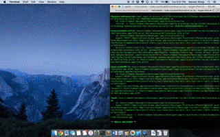

# Appify
Turn any website into a native app in seconds! For use with npm and cordova.

##Demo with iPad


## Setup
```bash
$ npm install -g cordova
$ cordova plugin add https://git-wip-us.apache.org/repos/asf/cordova-plugin-inappbrowser.git
$ git clone https://github.com/samkho10/appify.git <app-name>
```
## How to Use
  * Change variable  `WEBSITE_URL` to a URL of your choice.
  * Run application with the following command:
```bash
$ cordova run ios
```
  * Watch your app come to life!


